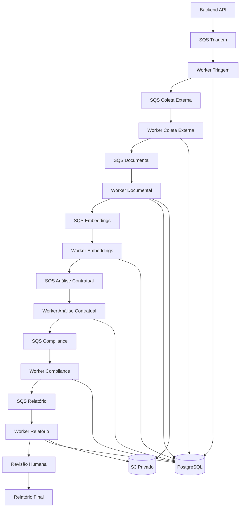

# Workflow de Agentes — LegalTech AWS V2

## 1. Objetivo

Este documento define o fluxo assíncrono de agentes/workers da LegalTech AWS V2.

A arquitetura recomendada usa:

```text
Backend API → SQS → Lambda Workers → PostgreSQL/S3 → Próxima fila
```

---

## 2. Princípio central

O backend cria jobs e publica mensagens em filas.

Os workers processam etapas específicas e registram tudo em `agent_executions`.

Regra obrigatória:

```text
Nenhum worker deve processar job sem validar organization_id, case_id e idempotência.
```

---

## 3. Filas recomendadas

```text
legaltech-triage-queue
legaltech-external-collection-queue
legaltech-document-processing-queue
legaltech-embedding-queue
legaltech-contract-analysis-queue
legaltech-compliance-queue
legaltech-report-queue
legaltech-notification-queue
```

Cada fila crítica deve ter DLQ:

```text
legaltech-triage-dlq
legaltech-external-collection-dlq
legaltech-document-processing-dlq
legaltech-embedding-dlq
legaltech-contract-analysis-dlq
legaltech-compliance-dlq
legaltech-report-dlq
legaltech-notification-dlq
```

---

## 4. Payload padrão de job

```json
{
  "job_id": "uuid",
  "organization_id": "uuid",
  "case_id": "uuid",
  "document_id": "uuid-opcional",
  "agent_type": "triagem",
  "attempt": 1,
  "requested_by": "user_id",
  "created_at": "2026-05-23T20:00:00Z",
  "metadata": {}
}
```

---

## 5. Regra de idempotência

Antes de processar:

1. Buscar `agent_executions` por `job_id`.
2. Se status for `completed`, retornar sucesso sem executar novamente.
3. Se status for `running` há pouco tempo, evitar duplicidade.
4. Se status for `failed` e tentativa permitida, processar retry.
5. Registrar início e fim da execução.

---

## 6. Fluxo completo

```text
1. Cliente envia caso.
2. Backend valida caso.
3. Backend cria job de triagem.
4. SQS entrega job ao worker de triagem.
5. Worker registra execução.
6. Worker valida dados mínimos.
7. Worker publica próxima etapa.
8. Coleta externa consulta APIs.
9. Documental processa arquivos.
10. Embeddings cria vetores.
11. Análise contratual usa RAG.
12. Compliance valida riscos.
13. Relatório gera minuta.
14. Revisão humana aprova.
15. Relatório final é liberado.
```

---

## 7. Diagrama Mermaid



---

## 8. Agente de triagem

Entrada:

```text
case_id
organization_id
requested_by
```

Responsabilidades:

- verificar se caso existe;
- verificar se pertence à organização;
- verificar status do caso;
- validar dados mínimos;
- validar partes;
- validar documentos obrigatórios;
- atualizar status do caso;
- publicar próxima fila.

Saídas possíveis:

```text
completed
failed
requires_human_review
```

---

## 9. Agente de coleta externa

Responsabilidades:

- consultar APIs externas autorizadas;
- normalizar respostas;
- salvar resposta bruta quando permitido;
- salvar evidências;
- usar cache por `query_hash`;
- registrar erros por provedor;
- publicar próxima etapa.

Provedores possíveis:

```text
Escavador
Serasa
TargetData
Registros públicos
Outras APIs contratadas
```

---

## 10. Agente documental

Responsabilidades:

- baixar documento do S3;
- normalizar arquivo para Markdown antes de gerar chunks;
- extrair texto apenas de formatos suportados localmente;
- classificar documento;
- separar em páginas;
- gerar chunks;
- salvar `document_chunks`;
- atualizar status do documento;
- publicar fila de embeddings.

Cuidados:

- não logar conteúdo completo;
- tratar PDF corrompido;
- tratar PDF escaneado como `requires_ocr`, sem tentar OCR nesta etapa;
- tratar arquivo ilegível;
- registrar erro técnico.

Normalização inicial local:

```text
.txt  -> Markdown simples
.md   -> Markdown normalizado
.docx -> parágrafos e tabelas simples em Markdown
.pdf  -> páginas com texto extraível em Markdown
```

O Markdown convertido deve ser salvo em storage privado/local ignorado pelo Git.
Jobs de fila continuam transportando apenas IDs e metadados mínimos, nunca o
conteúdo integral do documento.

---

## 11. Agente de embeddings

Responsabilidades:

- ler chunks;
- gerar embeddings;
- salvar no pgvector;
- associar vetores ao caso/documento;
- publicar análise contratual.

Regra:

```text
Sempre filtrar chunks por organization_id e case_id.
```

---

## 12. Agente de análise contratual

Responsabilidades:

- recuperar contexto via pgvector;
- montar análise estruturada;
- identificar cláusulas sensíveis;
- detectar riscos;
- produzir saída JSON;
- evitar conclusão jurídica definitiva sem revisão.

Saída esperada:

```json
{
  "summary": "Resumo da análise",
  "risks": [],
  "clauses": [],
  "recommendations": [],
  "requires_human_review": true
}
```

---

## 13. Agente de compliance

Responsabilidades:

- revisar saída da análise;
- identificar inconsistências;
- validar se há evidência para conclusões;
- marcar pontos que exigem revisão humana;
- bloquear relatório automático quando houver risco alto.

---

## 14. Agente de relatório

Responsabilidades:

- gerar minuta;
- estruturar relatório em JSON/HTML;
- salvar versão;
- criar registro em `reports`;
- criar registro em `human_reviews`;
- não liberar ao cliente sem aprovação.

---

## 15. Agente de notificação

Responsabilidades:

- notificar cliente ou equipe;
- enviar e-mails transacionais;
- avisar analista sobre revisão pendente;
- avisar cliente sobre relatório aprovado.

---

## 16. Estados dos agentes

```text
queued
running
completed
failed
retrying
dead_letter
skipped
requires_human_review
```

---

## 17. Estados do caso

```text
draft
submitted
triage_pending
triage_failed
external_collection_pending
document_processing_pending
contract_analysis_pending
compliance_pending
report_draft_pending
human_review_pending
approved
delivered
failed
cancelled
```

---

## 18. Tratamento de erro

Em caso de erro:

1. Atualizar `agent_executions.status = failed`.
2. Salvar erro resumido.
3. Incrementar tentativa.
4. Deixar SQS controlar retry.
5. Enviar para DLQ após limite.
6. Permitir reprocessamento manual.

---

## 19. Logs mínimos por execução

Registrar:

```text
job_id
agent_type
organization_id
case_id
document_id
status
attempt
started_at
completed_at
duration_ms
error_message
```

---

## 20. Conclusão

O workflow de agentes deve ser previsível, rastreável e auditável.

Regra principal:

```text
Todo processamento precisa deixar rastro em agent_executions e audit_log quando envolver ação sensível.
```
