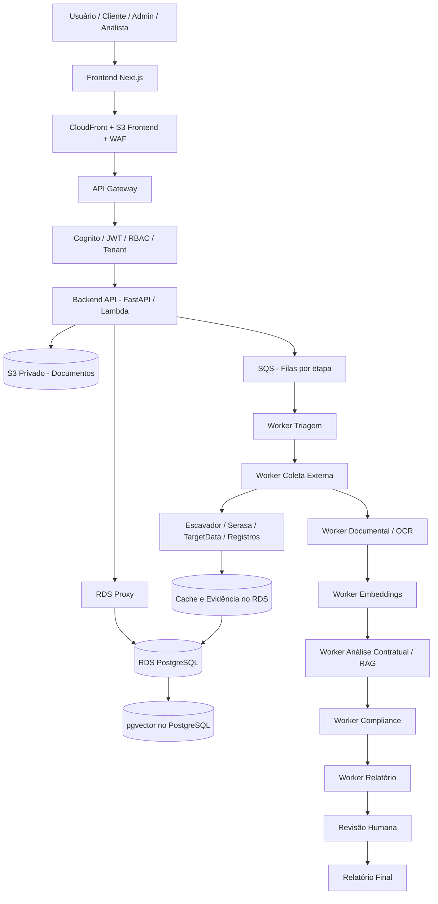

# Arquitetura LegalTech AWS V2

## 1. Objetivo

Este documento define a arquitetura técnica recomendada para o MVP da plataforma **LegalTech AWS V2**, uma solução SaaS para:

- análise jurídica;
- due diligence;
- consulta de partes;
- consulta de objetos;
- análise contratual;
- geração de relatórios;
- revisão humana por analista ou advogado.

A arquitetura foi desenhada para iniciar simples, mas com fundação correta para segurança, LGPD, auditoria, multi-tenant e evolução futura.

---

## 2. Decisão técnica principal

| Camada | Escolha recomendada | Motivo |
|---|---|---|
| Frontend | Next.js + TypeScript | Interface moderna, tipada e preparada para expansão |
| Backend API | FastAPI + Python + Mangum | Boa integração com AWS Lambda, S3, SQS, PostgreSQL e agentes |
| Banco principal | Amazon RDS PostgreSQL | Dados estruturados, auditoria, relatórios SQL e consistência |
| Vetorial/RAG | pgvector no PostgreSQL | Evita banco vetorial separado no MVP |
| Arquivos | Amazon S3 privado | Armazenamento seguro de documentos, contratos e relatórios |
| Processamento | AWS Lambda + SQS | Fluxo assíncrono, retry, desacoplamento e escalabilidade |
| Autenticação | Cognito/JWT/RBAC/Tenant | Controle de acesso por usuário, empresa e perfil |
| Segredos | AWS Secrets Manager ou SSM Parameter Store | Proteção de tokens, chaves e credenciais |
| Observabilidade | CloudWatch + CloudTrail + AWS Budgets | Logs, auditoria técnica e controle de custos |

---

## 3. Visão geral da arquitetura

```text
Usuário / Cliente / Admin / Analista
        ↓
Frontend Next.js
        ↓
CloudFront + S3 Frontend + WAF
        ↓
API Gateway
        ↓
Auth: Cognito / JWT / RBAC / Tenant
        ↓
Backend API - FastAPI em Lambda
        ↓
RDS Proxy
        ↓
RDS PostgreSQL + pgvector
        ↓
S3 Privado para documentos
        ↓
SQS por etapa do processo
        ↓
Lambda Workers / Agentes IA
        ↓
APIs externas: Escavador, Serasa, TargetData, registros públicos
        ↓
Cache, evidências, auditoria e relatório final
```

---

## 4. Diagrama Mermaid



---

## 5. Componentes principais

### 5.1 Frontend

Responsável por:

- login;
- dashboard;
- criação de casos;
- cadastro de partes;
- upload de documentos;
- acompanhamento de status;
- visualização de relatórios;
- painel de analista;
- painel administrativo.

Stack recomendada:

```text
Next.js
TypeScript
React
React Hook Form
Zod
Tailwind ou Shadcn UI
```

---

### 5.2 Backend API

Responsável por:

- autenticação e autorização;
- validação de tenant;
- CRUD de clientes;
- CRUD de casos;
- upload seguro via presigned URL;
- criação de jobs em SQS;
- consulta de status;
- geração de logs de auditoria;
- exposição de rotas para frontend.

Stack recomendada:

```text
FastAPI
Python
SQLAlchemy
Alembic
Pydantic
Mangum
Boto3
```

---

### 5.3 Banco de dados

Banco principal:

```text
Amazon RDS PostgreSQL
```

Usos:

- usuários;
- empresas;
- clientes;
- casos;
- partes;
- documentos;
- auditoria;
- cache de consultas externas;
- execuções dos agentes;
- relatórios;
- revisões humanas;
- embeddings com pgvector.

---

### 5.4 S3 privado

Armazena:

- contratos;
- certidões;
- documentos anexados;
- imagens;
- relatórios gerados;
- evidências documentais.

Regras:

- bucket privado;
- acesso somente via backend;
- frontend só usa presigned URL temporária;
- validação de tipo, tamanho e hash;
- criptografia habilitada.

---

### 5.5 SQS e Lambda Workers

Processamento assíncrono:

```text
triagem
coleta_externa
documental
embeddings
analise_contratual
compliance
relatorio
notificacao
```

Cada etapa deve registrar execução em `agent_executions`.

---

## 6. Multi-tenant

Toda entidade sensível deve possuir:

```sql
organization_id UUID NOT NULL
```

O backend **nunca** deve confiar em `organization_id` enviado pelo frontend.

A organização deve ser resolvida a partir de:

- JWT;
- vínculo interno usuário/organização;
- middleware de tenant.

---

## 7. Segurança essencial

Regras obrigatórias:

1. Frontend nunca recebe chave de API externa.
2. Frontend nunca acessa S3 diretamente sem presigned URL.
3. Backend nunca confia em `organization_id` vindo do frontend.
4. Toda leitura de caso, documento e relatório valida permissão.
5. Toda ação sensível gera `audit_log`.
6. Toda tabela sensível possui `organization_id`.
7. Toda credencial fica em Secrets Manager ou SSM.
8. Upload valida tipo, tamanho e hash.
9. Relatório jurídico final exige revisão humana.
10. Logs não podem expor dados sensíveis desnecessariamente.

---

## 8. Por que n8n não é pilar obrigatório nesta versão

O n8n pode ser útil em automações periféricas, mas não deve ser o núcleo do MVP jurídico porque:

- aumenta dependência externa;
- dificulta auditoria técnica centralizada;
- pode gerar fragilidade em fluxos sensíveis;
- exige cuidado extra com dados pessoais;
- pode complicar rastreabilidade de decisões jurídicas.

Nesta versão, o fluxo principal fica em:

```text
Backend API → SQS → Lambda Workers → Banco/Auditoria
```

---

## 9. Ordem de evolução

```text
Base técnica
→ Casos
→ Documentos
→ Filas
→ Workers
→ APIs externas
→ RAG
→ Revisão humana
→ Relatório
→ Deploy
```

---

## 10. Conclusão

A arquitetura correta para o MVP LegalTech AWS V2 é uma arquitetura serverless/modular baseada em AWS, com backend forte, banco relacional, armazenamento privado, processamento assíncrono e auditoria desde o início.

O foco inicial deve ser segurança, organização, isolamento por tenant e fluxo funcional antes de implementar agentes avançados de IA.
